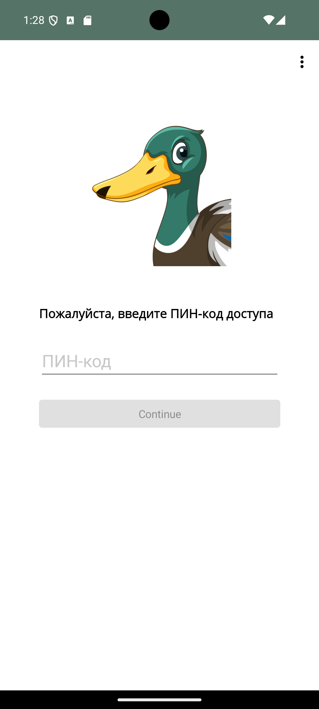
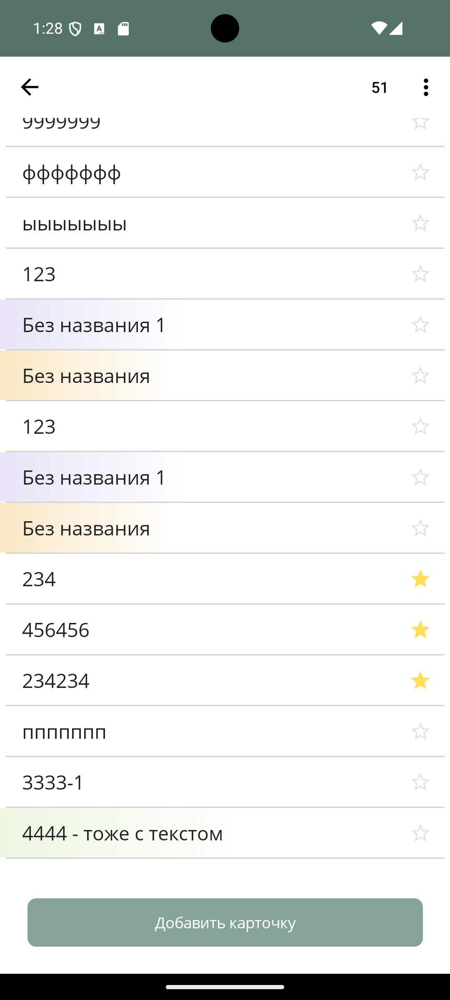
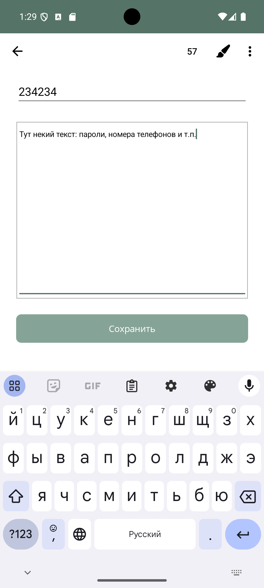
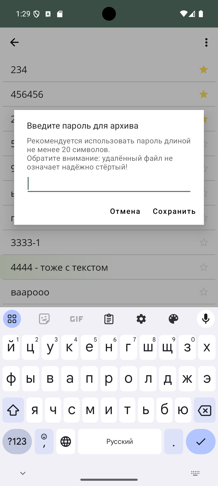
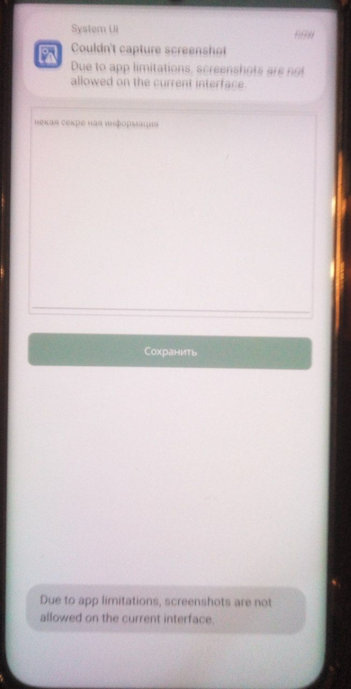

# TheDuckIsWatching 
# Защищённый блокнот (Android)

**Версия:** 0.9 бета  
**Платформа:** Android  
**Технологии:** [.NET MAUI](https://learn.microsoft.com/ru-ru/dotnet/maui/), C#, SQLite  

## Описание

Есть такое психическое заболевание Анатидаефобия - когда человеку кажется, что за ним постоянно следит утка.
Может следит, а может нет. Кто ж знает...

Простое и безопасное приложение-блокнот для Android, разработанное на **.NET MAUI** с использованием **C#**.  

> Приложение предназначено **только для Android**. Поддержка других платформ не планируется.

## Особенности

- Локальное хранение данных в зашифрованной SQLite.
- Использование Android Keystore.
- Без MVVM и CommunityToolkit.
- Экспорт через системную функцию "Отправить" (без разрешений на доступ к файлам).
- Таймер закрывает страницы для сохранности данных.
- Интерфейс и справка только на русском языке (перевод будет добавлен при необходимости).
- Запрет скриншотов.

## Структура проекта

```bash
/Models     — модели данных для работы с БД
/Pages      — XAML-страницы приложения
/Services   — интерфейсы и реализации сервисов
/Utils      — вспомогательные классы, конвертеры и базовые компоненты
```

## Установка и запуск

### Требования

- Visual Studio 2022 с установленной поддержкой .NET MAUI
- Android SDK
- Эмулятор Android или физическое устройство

### Компиляция

1. Откройте проект в Visual Studio.
2. Создайте в эмуляторе устройство **Android** 15 версии или подключите устройство в режиме DEBUG.
3. Запустите проект.

### Примечания

- Чтобы получить экспортированный файл на эмуляторе, установите файловый менеджер (встроенного нет).

## Скриншоты 

> 
 
 
 
 
 

## Сообщить об ошибке

Если вы нашли баг:

1. Попробуйте очистить данные эмулятора, сборки и пересоберите проект.
2. Создайте новое сообщение, подробно описав проблему.

## Лицензия

В самом проекте в разделе Справка.

## Контакты

Если у вас есть вопросы — создавайте Issue или напишите автору.